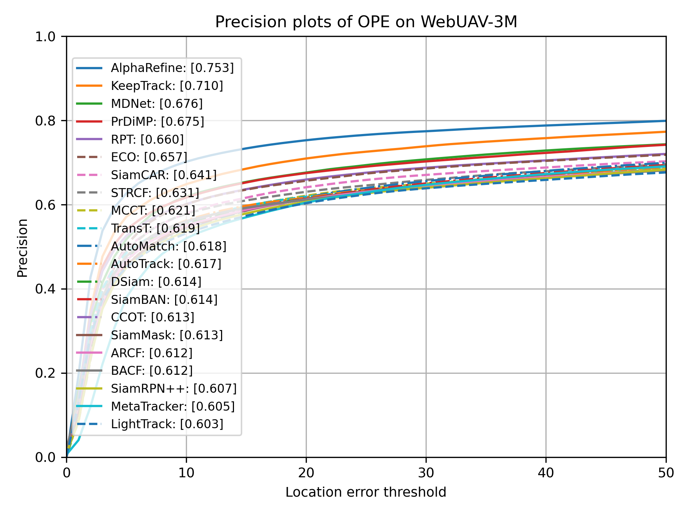
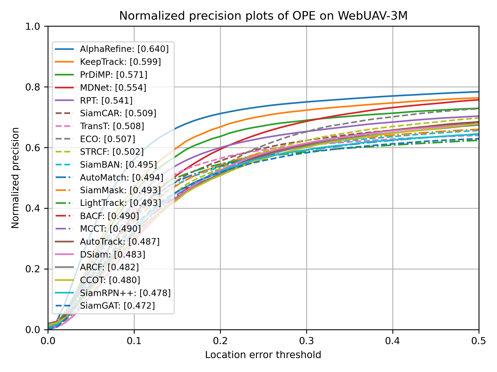
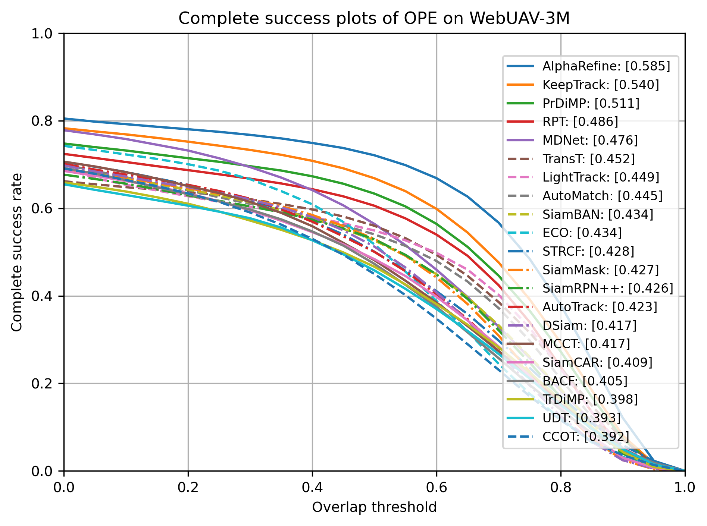

# WebUAV-3M: A Benchmark for Unveiling the Power of Million-Scale Deep UAV Tracking [[Paper Link](https://arxiv.org/abs/2201.07425)]
### Abstract

Unmanned aerial vehicle (UAV) tracking is of great significance for a wide range of applications, such as delivery and agriculture. Previous benchmarks in this area mainly focused on small-scale tracking problems while ignoring the amounts of data, types of data modalities, diversities of target categories and scenarios, and evaluation protocols involved, greatly hiding the massive power of deep UAV tracking. In this work, we propose WebUAV-3M, the largest public UAV tracking benchmark to date, to facilitate both the development and evaluation of deep UAV trackers. WebUAV-3M contains over 3.3 million frames across 4,500 videos and offers 223 highly diverse target categories. Each video is densely annotated with bounding boxes by an efficient and scalable semiautomatic target annotation (SATA) pipeline. Importantly, to take advantage of the complementary superiority of language and audio, we enrich WebUAV-3M by innovatively providing both natural language specifications and audio descriptions. We believe that such additions will greatly boost future research in terms of exploring language features and audio cues for multimodal UAV tracking. In addition, a fine-grained UAV tracking-under-scenario constraint (UTUSC) evaluation protocol and seven challenging scenario subtest sets are constructed to enable the community to develop, adapt and evaluate various types of advanced trackers. We provide extensive evaluations and detailed analyses of 43 representative trackers and envision future research directions in the field of deep UAV tracking and beyond. The dataset, toolkits and baseline results are available at this page.


## Changelog
- Aug. 1, 2022: The WebUAV-3M Evaluation Toolkits V1.0 released.
- Aug. 1, 2022: The Baseline Results released.
- Aug. 1, 2022: The WebUAV-3M dataset V1.0 released.

### TODO
- [x] Evaluation Toolkits 
- [x] Video Sequences of WebUAV-3M Dataset
- [x] Baseline Results
- [ ] Language and Audio Annotations

## Dataset Download

The WebUAV-3M dataset contains 4500 videos, divided into three sets (*Train*/*Val*/*Test*)

The dataset download and file organization process are as follows：

- Download the whole dataset through [Baidu Pan](https://docs.google.com/forms/d/e/1FAIpQLSe5Usq9VUSGjKollBCI1heln_o6u4SuiMcBRn_FNqp4v2d0Kw/viewform?usp=pp_url), the extraction code is ***UAV3***.
- Download the whole dataset through [Google drive](https://docs.google.com/forms/d/e/1FAIpQLSe5Usq9VUSGjKollBCI1heln_o6u4SuiMcBRn_FNqp4v2d0Kw/viewform?usp=pp_url), coming soon...

- Check the number of videos in each set.

  - The *Train* set should include 3520 videos (621G)

  - The *Val* set should include 200 videos (28G)

  - The *Test* set should include 780 videos (170G)

- We also provide the adversarial examples sub-set (WebUAV-3M-AE) to evaluate the robustness of trackers (optional).

  - The *WebUAV-3M-AE* should include 100 (clean) + 500 (with adversarial examples) videos (186G)

- We plan to release the language and audio annotations soon. Stay tuned.

- Run the unzipping script, and delete the script after decompression.

```
bash UnzipWebUAV3M-Train.sh
bash UnzipWebUAV3M-Val.sh
bash UnzipWebUAV3M-Test.sh
bash UnzipWebUAV3M-AE.sh (optional)
```

## How to Evaluate Performance?

For Overall, Attribute, Accuracy and UTUSC Protocol evaluations in OPE using Pre, nPre, AUC, cAUC and mAcc metrics:

```Python
# Run experiments on dataset

# Put the results in WebUAV-3M_Evaluation_Toolkit/results/Baseline_Results

# Report tracking performance

python WebUAV-3M_Overall_Evaluation.py

python WebUAV-3M_Attribute_Evaluation.py

python WebUAV-3M_Accuracy_Evaluation.py

python WebUAV-3M_UTUSC_Protocol.py
```

## Results of SOTA Trackers
|Precision plot|Normalized precision plot|
|:----:|:----:|
|||
|**Success plot**|**Complete success plot**|
|||

### Environment

The experiments are implemented using PyTorch or MATLAB with an Intel (R) Xeon (R) Gold 6230R CPU @ 2.10GHz and three NVIDIA RTX A5000 GPUs on an Ubuntu 18.04 server.


### Citation

If you find the dataset and toolkits useful in your research, please consider citing:

    @inproceedings{WebUAV_3M_2022,
        title={WebUAV-3M: A Benchmark for Unveiling the Power of Million-Scale Deep UAV Tracking},
        author = {Chunhui Zhang, and Guanjie Huang, and Li Liu, and Shan Huang, and Yinan Yang, and Xiang Wan, and Shiming Ge, and Dacheng Tao},
        journal = {arXiv:2201.07425},
        year = {2022}
      }


### Acknowledgments
Thanks for the great [[GOT-10k toolkit](https://github.com/got-10k/toolkit)]

### Concat

Feedbacks and comments are welcome! Feel free to contact us via [andyzhangchunhui@gmail.com](mailto:andyzhangchunhui@gmail.com) or [rasel.laffel@live.com](mailto:rasel.laffel@live.com) or [liuli@cuhk.edu.cn](mailto:liuli@cuhk.edu.cn).
